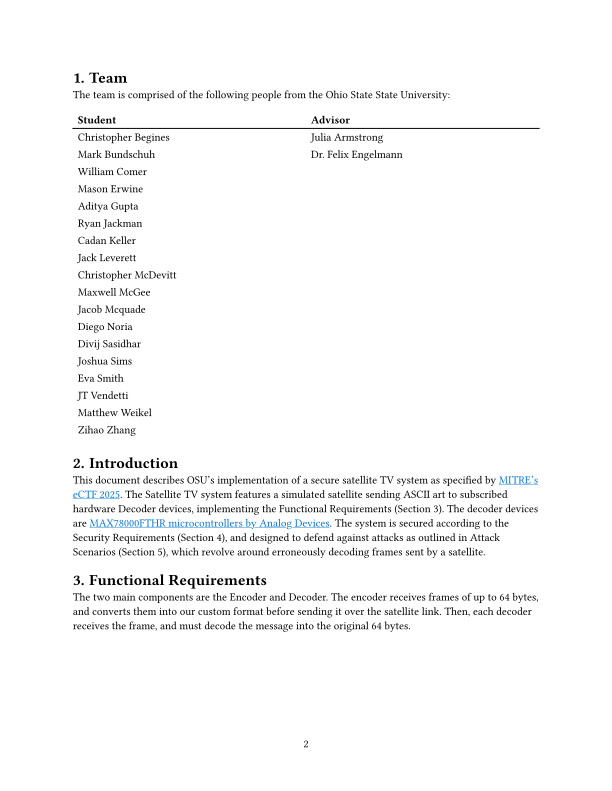
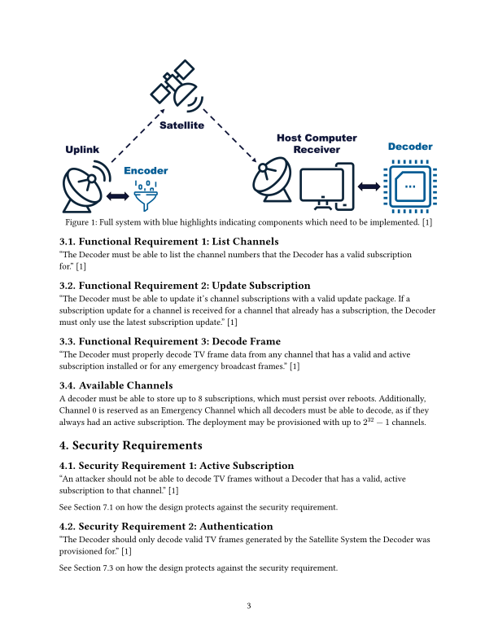
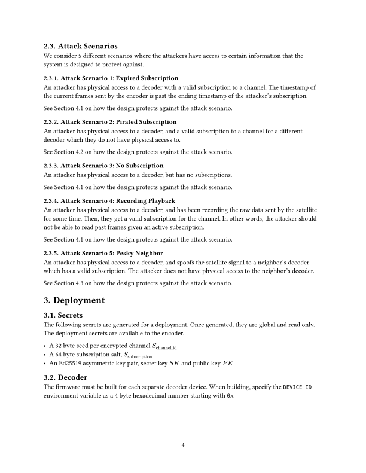
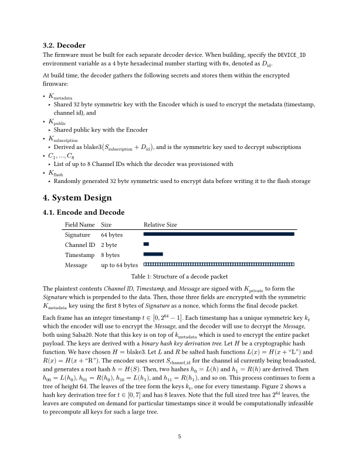
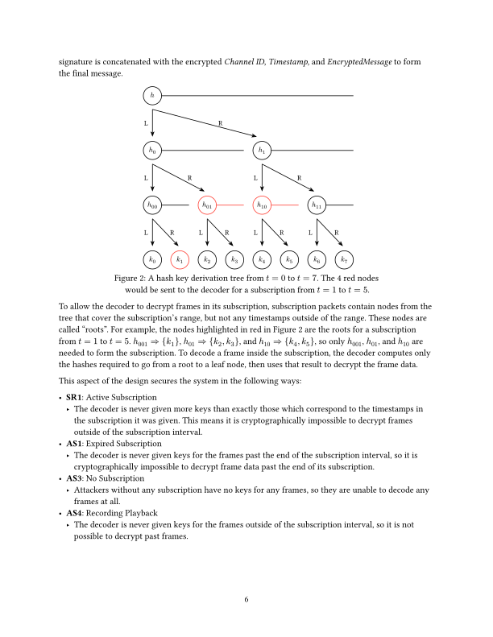
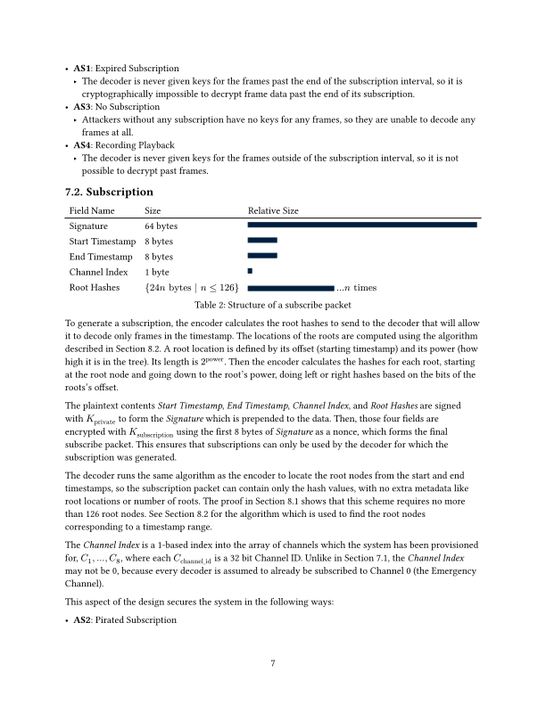
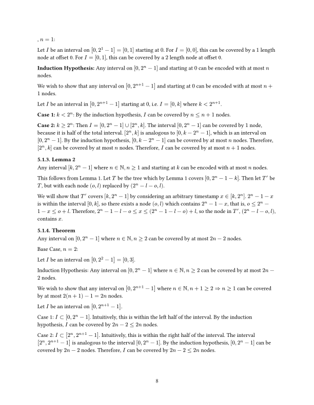
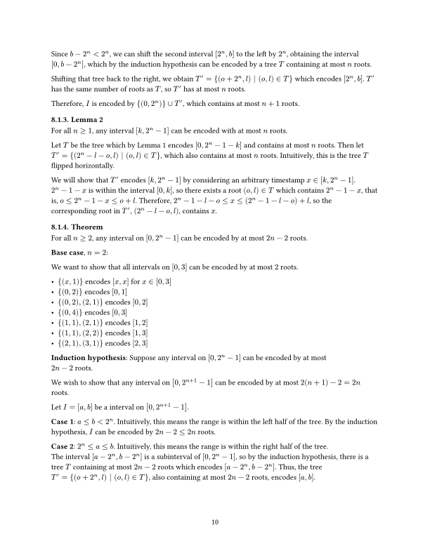
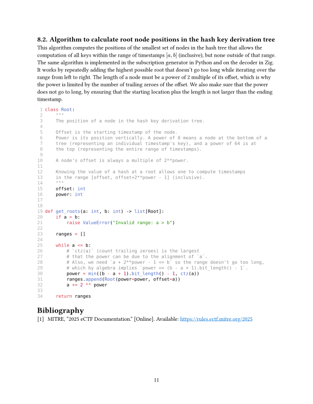
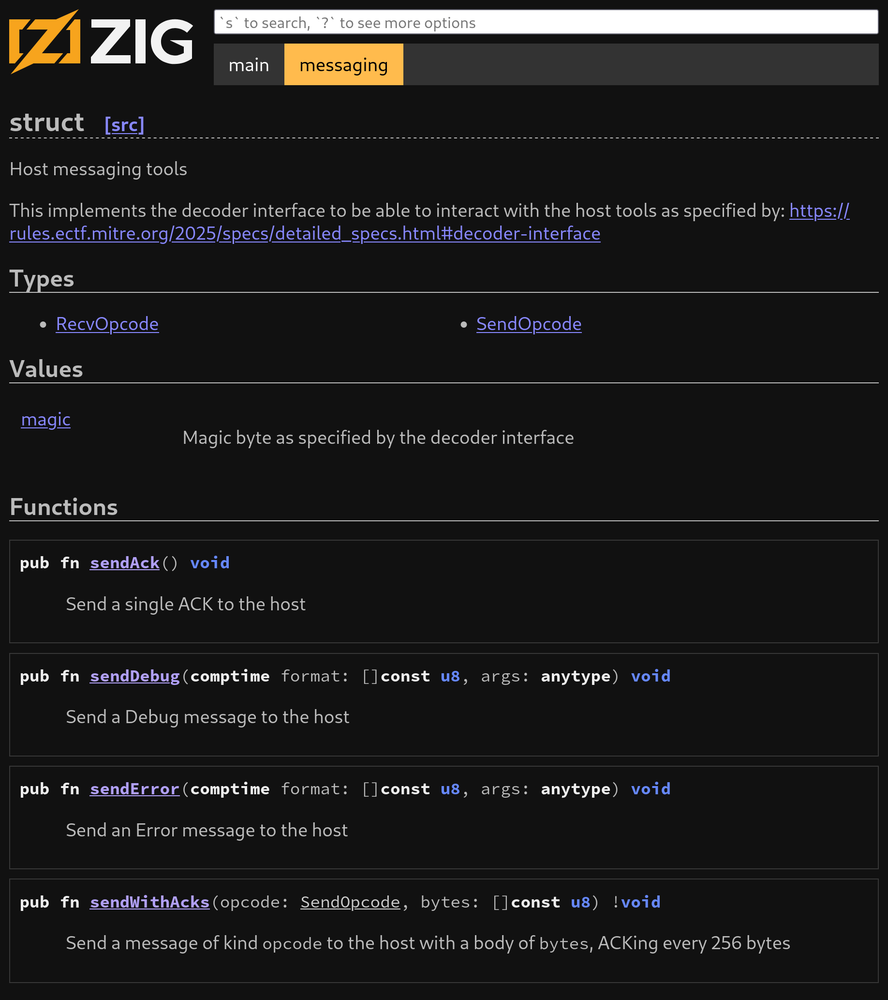

# OSU Satellite TV for MITRE eCTF 2025

[](https://ziglang.org) [](https://github.com/OSU-embedded-security-club/ectf-osu-2025/actions/workflows/zig.yaml) [](https://github.com/OSU-embedded-security-club/ectf-osu-2025/actions/workflows/ectf.yaml) [](https://github.com/OSU-embedded-security-club/ectf-osu-2025/actions/workflows/documentation.yaml)

This repo contains all the code and documentation for team `scriptohio` from The Ohio State University in [MITRE's eCTF 2025](https://rules.ectf.mitre.org/2025/index.html).

Highlights of our design:

- 🔐 **Strong cryptography**
  - 💃 The [Salsa20](https://en.wikipedia.org/wiki/Salsa20) stream cipher is used for lightning quick symmetric encryption and decryption
  - 🌲 Our _binary hash key derivation tree_ efficiently compresses unique keys per timestamp to create a subscription over a time interval 🕐
  - 📝 All frames are signed and verified with [Ed25519](https://en.wikipedia.org/wiki/EdDSA#Ed25519) to ensure decoders only read frames from the encoder they came from
- ⚡ **Written in Zig**
  - 📦 Expansive standard library which includes everything a programmer might need, from string manipulation to secure cryptography
  - 🧪 Unit testing framework built in, allowing for critical sections to have their correctness verified
  - 🚫 Memory safety protections against common issues like indexing out of bounds, double free, integer overflows, and more
  - 🚧 Build system with incredible interoperability with C code. We still use the MSDK, and there are no HAL rewrites in sight 👀

## Layout 🌎

| Icon | Description                                                |
| ---- | ---------------------------------------------------------- |
| 👥   | Created by our team                                        |
| 👔   | Created by MITRE for the competition, and unmodified by us |

- 👥 `benches/` - Custom benchmarks to test the speed of the design 🐍
- 👥 `decoder/` - Firmware for the decoder ⚡
- 👥 `design/` - Host design including encoder 🐍
- 👥 `docs/` - Documentation on the system design and security 📖
- 👔 `tools/` - Host tools to interact with the decoder 🐍
- 👥 `Taskfile.yml` - Command runner definitions 📄
- 👥 `flake.nix` - Convenient [Nix](https://nixos.org) development environment ❄️

## Usage

A [Taskfile](https://taskfile.dev) is available to easily run common tasks

```
* 1-gen-secrets: Generate secrets
* 2-build-firmware: Build the firmware image
* 3-flash: Flash the built firmware image onto the Decoder
* 4-gen-subscription: Generate a subscription
* 5-subscribe: Take a subscription file and send it to the Decoder
* 6-list: Asks the Decoder to list the subscriptions that it currently has
* 7-uplink: Encodes sample frames with the custom encoder function and sends them to the satellite
* 8-satellite: Broadcasts all frames received from the uplink to all listening TVs on the host computer
* 9-tv: Receives encoded frames from the satellite and decodes with a Decoder connected to the host computer
* bench-decoder: Benchmark the decoder
* bench-encoder: Benchmark the encoder
* bench-subscription: Benchmark creating a subscription on the decoder
* docs: Build documentation design file into PDF and SVG artifacts
* stress-decoder: Use MITRE's stress test to benchmark the decoder
* stress-encoder: Use MITRE's stress test to benchmark the encoder
```

On a clean repo, plug in the MAX78000, enter firmware writing mode (the LED should be flashing blue), and run the following command:

```
task 1-gen-secrets 2-build-firmware 3-flash 4-gen-subscription 5-subscribe 6-list
```

Then, iterating on the design is typically done with the following command:

```
task 2-build-firmware 3-flash
```

## Documentation 📖

[](https://typst.app/home)

The design document is available to read [as a PDF](docs/design.pdf), or inline below:

<details>
  <summary>View the PDF inline</summary>
  
  
  
  
  
  
  
  
  
  
  
</details>

## Code Documentation 📖

Our Zig code makes use of documentation comments which can be read as a webpage. To view it, navigate to the `decoder` directory and run the following

```
$ zig build docs
$ python -m http.server -d docs
```

Then navigate to [http://localhost:8000](http://localhost:8000) in your browser.


